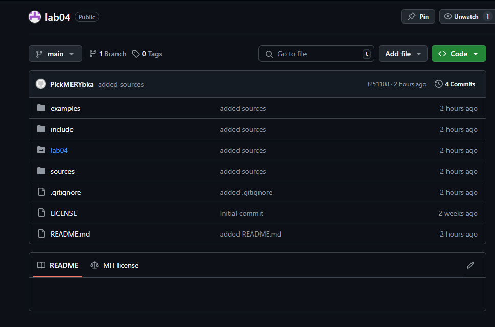
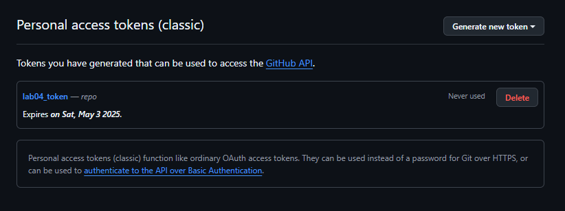
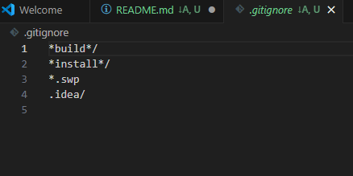
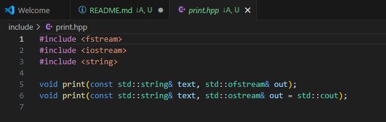
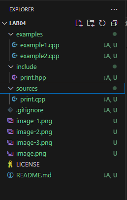

# Отчёт по лабораторной работе №4

## Выполненное задание

### 1. Создание публичного репозитория lab04 с лицензией MIT
- Создан репозиторий на GitHub: https://github.com/PickMERYbka/lab04  
 

### 2. Генерация токена для доступа к GitHub
- Сгенерирован токен с правами repo.  

### 3. Выполнение инструкции учебного материала
- Настроены переменные окружения: GITHUB_USERNAME, GITHUB_EMAIL, GITHUB_TOKEN.
- Создан файл конфигурации hub для работы с GitHub.
- Инициализирован локальный репозиторий в C:\Users\Darya\Documents\GitHub\lab04\lab04.
- Настроены имя и email для Git.
- Добавлен удалённый репозиторий и выполнен первый pull.
- Создан файл README.md и закоммичен.
- Добавлен файл .gitignore с указанным содержимым.
- Созданы директории sources, include, examples и файлы print.cpp, print.hpp, example1.cpp, example2.cpp.
- Обновлён README.md, выполнен коммит и push.  

Всё закоммиченно все дела, (у меня в терминале история пропала выполнения команд)
### 5. Составление отчёта
- Склонирован репозиторий tp-labs/lab04.
- Скопирован README.md в REPORT.md.
- Отчёт опубликован на gist.github.com.  
([Во](https://gist.github.com/PickMERYbka/994b6615e96a8338939f77100b548c99))